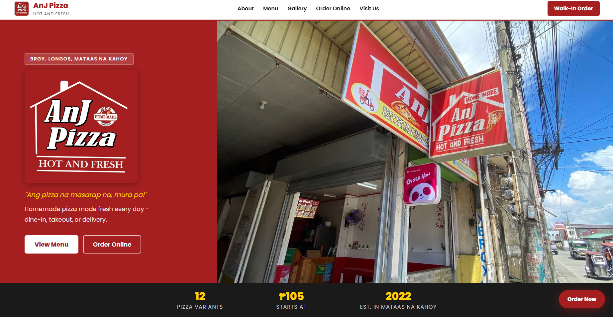
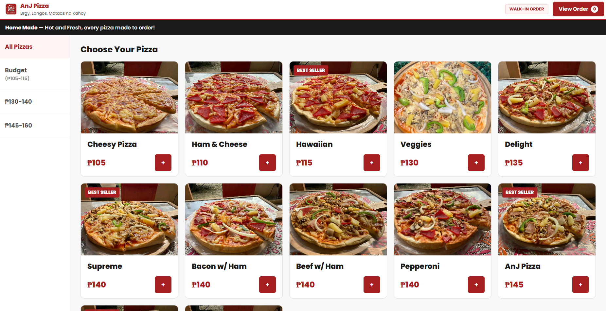
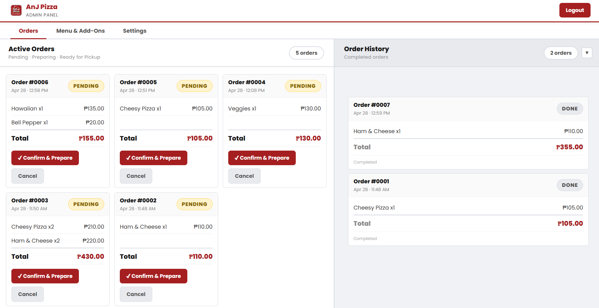

# AnJ Pizza — Business Website & Ordering System

DC102 - Web Development 2 | BSCS 2B, Group 6

---

## Screenshots


*Public homepage with menu and store information*


*Walk-in kiosk ordering interface*


*Admin panel — sales and order queue*

---

## Overview

AnJ Pizza (est. November 2022) is located at Brgy. Longos, Mataas na Kahoy, Batangas. Customers can browse the menu, customize their pizza, and place walk-in orders through a kiosk interface. Staff manage products, monitor incoming orders, and review transaction history through a separate admin panel.

**Stack:** PHP 8, MySQL, Vanilla JS, Apache (XAMPP)

---

## Features

**Customer (Kiosk)**
- Menu browsing with category filters (Budget, ₱130–140, ₱145–160)
- Pizza customization with add-ons
- Cart management and order confirmation
- Auto-generated order number on completion
- Idle session timeout with countdown
- Links to Foodpanda and GrabFood for delivery orders

**Admin**
- Secure login with session management
- Dashboard with sales summary
- Full product, ingredient, and add-on management
- Live walk-in order queue
- Transaction history with receipt viewer

---

## Getting Started

### Requirements

- [XAMPP](https://www.apachefriends.org/) v8.x or higher (Apache + MySQL + PHP)
- Any modern browser

### Installation

1. Clone or download this repository and place it in your XAMPP `htdocs` folder:

   ```
   C:\xampp\htdocs\anj-pizza\
   ```

2. Start **Apache** and **MySQL** from the XAMPP Control Panel.

3. Open `http://localhost/phpmyadmin`, create a database named `anj_pizza`, and import the SQL file from the `/database` folder.

4. In the `api/` folder, rename `db.example.php` to `db.php` and confirm the connection settings:

   ```php
   $host = 'localhost';
   $db   = 'anj_pizza';
   $user = 'root';
   $pass = '';
   ```

5. Open `http://localhost/anj-pizza/` in your browser.

---

## Access Credentials

| Interface | Credential |
|-----------|-----------|
| Walk-in Kiosk | Code: `1234` |
| Admin Panel | Username: `admin` / Password: `password` |

> These are local development credentials.

---

## Project Structure

```
anj-pizza/
├── index.html          # Customer homepage and kiosk
├── index.css
├── index.js
├── admin.html          # Admin panel
├── admin.css
├── admin.js
├── api/
│   ├── db.example.php  # Rename to db.php and configure
│   ├── auth.php
│   ├── menu.php
│   └── orders.php
├── database/
│   └── anj_pizza.sql
└── images/
    ├── logo.jpg
    └── store/
```

---

## Group Members

BSCS 2B — Group 6 | AY 2025–2026
DC102 - Web Development 2 

---

## License

This project was created for academic purposes only (DC102 - Web Development 2, AY 2025–2026).
Do not reuse, redistribute, or claim this work as your own without permission from the original authors.

---

## Acknowledgements

AnJ Pizza, for allowing us to use their business for this project.
